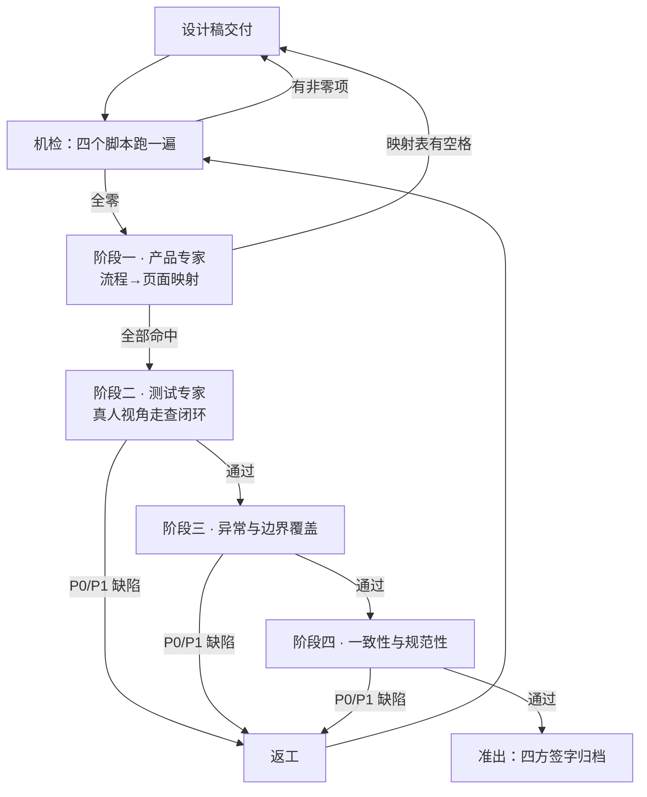

# 设计稿闭环检查机制

> **适用对象**：设计稿（`ui-ux-pro-max` 产出的可点 HTML 原型 / Figma 可交互稿 / Axure 稿）**生成之后**的验收。
> **不适用**：需求前期调研、PRD 撰写本身、研发实现与代码评审。
>
> **本文件在 `pm-master` 与 `pm-prd-spec` 两个技能下各有一份完全相同的副本**（bundle 要能独立安装）。
> 改其中一份**必须**同步另一份，否则两条链会给出不同的验收口径。

---

## 0 这套机制要解决的问题

设计稿评审最常见的失败不是"画得不好看"，而是**三种看不见的断点**：

| 断点形状 | 典型表现 | 为什么评审时发现不了 |
| --- | --- | --- |
| **流程有、页面无** | PRD 写了「首次登录必须改密」，设计稿没有这一屏；账号体系只有「注销」没有「退出登录」 | 逐页看设计稿时每页都对，**缺的那一页不在任何一页上** |
| **页面有、走不到** | 「注册完成 · 进度结转」屏只有出稿工具条能切；搜索页的「输入中 · 联想」态点不出来 | 演示时评审者被引导着走，**没人从头自己点一遍** |
| **点得动、没反应** | 按钮绑了事件、扫描全绿，点下去不跳不切不弹 | 静态属性检查只证明"有绑定"，**证明不了"有去处"** |

因此本机制的核心判据是**四层递进**，上一层不通过不进下一层：

```
① 存在性  流程的每个节点有没有对应的页面 / 状态 / 浮层
     ↓
② 可达性  这些页面 / 状态能不能从界面上点到（而不是只能靠工具条切）
     ↓
③ 闭环性  点进去之后能不能完成、能不能返回、能不能中断、能不能从异常恢复
     ↓
④ 一致性  同一个动作在不同位置的字段、文案、组件、状态流转是否一致
```

**禁止**跳层检查。存在性没过就走人工走查，等于拿人力去补机器能穷举的活。

---

## 1 角色与职责分工

| 角色 | 检查什么 | 判据来源 | 产出 | 签字权 |
| --- | --- | --- | --- | --- |
| **产品专家**（PM） | 阶段一：业务流程 → 页面映射。每条流程线的每个节点有没有页面／状态／浮层／提示 | PRD 的页面清单、流程图、状态表、关联浮层总表 | 《流程-页面映射表》 | **阶段一准出签字** |
| **测试专家**（QA） | 阶段二 + 阶段三：以真人视角逐条走查真实路径；异常流、边界、权限、空态 | 阶段一的映射表 + PRD 的异常与边界章节 | 《走查记录》《缺陷清单》 | **阶段二、三准出签字** |
| **交互设计**（UX） | 阶段四：字段、文案、交互模式、组件复用、状态流转的一致性；以及被判为「不通过」项的修复方案 | 设计规范／组件库／文案表 | 《一致性问题清单》+ 修复稿 | **阶段四准出签字** |
| **研发**（DEV） | 全程旁听，只回答一个问题：**这份稿能不能直接照着实现**。发现"稿上有但实现不了"或"实现需要而稿上没有"的项 | 技术可行性、接口契约 | 《实现可行性异议单》 | **不签字，但异议未闭环时不得准出** |

**签字规则**：

- 每个阶段**必须**由该阶段责任人签字后才能进入下一阶段。
- 任何一人**可以**对已签字阶段提出复议，复议一旦成立，该阶段及其后所有阶段**必须**重新签字。
- **禁止**同一人同时签产品与测试两个阶段——出题的人不能自己判卷。
- 研发的异议单**必须**逐条有处置结论（采纳 / 不采纳 + 理由），**禁止**以"后续沟通"结案。

---

## 2 检查流程总览



| 阶段 | 输入 | 动作 | 输出 | 准出条件 |
| --- | --- | --- | --- | --- |
| **机检** | 设计稿源码 + 4 个脚本 | 自动扫描 | 四份扫描报告 | **四项全为 0** |
| **阶段一** | PRD 流程图/页面清单 + 设计稿 | 逐流程线逐节点对表 | 《流程-页面映射表》 | 表内**无空格**、无「待补」 |
| **阶段二** | 阶段一映射表 | 起本地服务器，真人逐条点 | 《走查记录》 | 每条路径四问全 YES |
| **阶段三** | PRD 异常章节 + 状态表 | 逐状态触发并核对 | 《异常覆盖表》 | 六类状态全覆盖 |
| **阶段四** | 设计规范 + 组件库 | 横向比对 | 《一致性清单》 | 无 P0/P1 |
| **准出** | 以上全部 | 四方会签 | 归档包 | 见 §8 |

**返工后必须从机检重跑**，不得只复验单点——改动会引入新的断点，这一条是踩出来的。

---

## 3 阶段一 · 产品专家检查：业务流程 → 页面映射

### 3.1 输入准备

1. 从 PRD 抽出**全部业务流程线**，逐条列出。**必须**包含这几类，缺一条即本阶段不通过：
   - **身份线**：授权/登录 → 注册 → 绑定 → 换绑 → 退出登录 → 注销 → 冷静期撤销
   - **主业务线**：产品的核心动线（如：浏览 → 详情 → 使用 → 完成 → 下一步）
   - **交易线**：触发消耗 → 下单 → 支付 → 成功/失败/待确认 → 退款/申诉 → 流水
   - **内容/创作线**：创建 → 编辑 → 提交 → 审核 → 通过/驳回 → 重新提交 → 下架
   - **权限线**：无权限 → 申请 → 审批 → 授予/拒绝 → 回收
   - **合规线**：协议同意 → 年龄门 → 实名 → 青少年模式 → 举报 → 处置回执
   - **消息线**：产生 → 触达 → 已读 → 进入详情 → 处置
2. 每条流程线**必须**拆成有序节点，节点粒度 = **用户能感知的一次状态变化**。

### 3.2 逐节点对表

对每个节点填写下表。**任何一格为空即判不通过。**

| 列 | 填什么 | 判定 |
| --- | --- | --- |
| 流程线 | 如「授权登录 → 退出」 | — |
| 节点序号 | 1、2、3… | — |
| 节点名 | 如「强拦登记」 | — |
| 承载物 | 页面 / 出稿状态 / 弹窗 / 半屏 / 吸底条 / Toast | **必须**具体到文件名或状态名 |
| 入口 | 从哪个页面的哪个控件进来 | **禁止**填「从上一步」，必须填控件名 |
| 出口（正常） | 完成后去哪 | **禁止**为空 |
| 出口（放弃） | 中途退出去哪 | **禁止**为空；不允许放弃的要写明理由 |
| PRD 出处 | 章节号 | **必须**有；找不到出处的节点要么是设计多做了，要么是 PRD 漏写了 |

### 3.3 三条必查规则

**R1 · 反向查引用。** 在 PRD 与设计稿里全文搜索「从 X 进入」「在 Y 页操作」这类引用，逐条确认 X、Y 真的存在。
> 实战：三处规格都写着「从『我的』进入」，而「我的」那一屏当时整个不存在——**静态检查抓不到这个方向**。

**R2 · 分档必须连入口一起分。** 若设计稿按首发档位分批，**必须**逐条验证：第一批要有的每一个能力，都能从第一批的页面里点到。
> 实战：把「开一场新戏」放进第三档之后，第一版就没有任何方式开始一场戏了。

**R3 · PRD 没写不等于不用做。** 发现"通用产品常识要求有、而 PRD 未写"的节点（如**退出登录**、**换绑**、**申诉入口**），**必须**登记为《PRD 缺口单》反提给需求侧，**禁止**设计侧自行沉默跳过，也**禁止**以此为由阻塞设计稿准出。

### 3.4 阶段一准出

- 《流程-页面映射表》**无空格**；
- 《PRD 缺口单》每条有结论（补 PRD / 本版不做 + 理由）；
- 产品专家签字。

---

## 4 阶段二 · 测试专家检查：真人视角走查闭环

### 4.1 铁律

> **静态快照点不动。必须起本地服务器（或可交互原型链接），用真人的手，从第一屏开始点。**

**禁止**以下三种代替走查：
- 看设计稿截图逐页核对；
- 跑一遍属性扫描脚本就判通过；
- 让出稿方演示一遍。

原因：属性扫描只能证明"控件绑了行为"，**证明不了"点下去有去处"**。典型反例——给按钮加「填完才启用」的门，门本身就是一种绑定，扫描全绿，而按钮点下去什么也不发生。

### 4.2 四问法

对**每一个可点控件**提四个问题，全部 YES 才算闭环：

| # | 问题 | 不通过的典型形状 |
| --- | --- | --- |
| **Q1 可进入** | 点它有没有东西出现／变化？ | 点了没反应；弹窗被遮罩挡住打不开；筛选项是不可点的文本而非按钮 |
| **Q2 可完成** | 这一步能不能走到终态？ | 表单只有只读行、没有输入控件与提交按钮；提交后停在原地 |
| **Q3 可返回** | 能不能回到上一层（不是回到首页）？ | 多层设置页的返回键恒指外层，一按直接退出整个模块 |
| **Q4 可中断** | 中途放弃有没有出口？放弃后状态对不对？ | 只有"确认"没有"取消"；取消后数据被清空或被提交 |

### 4.3 必走的六条真人路径

**必须**至少完整走通以下六条（按产品形态裁剪，但不得整条略过）：

1. **首次使用路径**：冷启动 → 引导 → 核心动作 → 触发注册 → 注册 → **回到被打断的那一步继续**（不是回首页、不是从头开始）。
2. **主业务完整路径**：入口 → 浏览 → 详情 → 执行 → 完成 → 下一步指引（**禁止**完成后把人丢回列表而不给下一步）。
3. **消费路径**：触发消耗 → 余额不足 → 充值 → 支付成功 → **回到原消耗点的确认态**（**禁止**自动扣费、**禁止**回到首页）。
4. **多步表单路径**：第 1 步 → 第 2 步 → 返回第 1 步（**已填内容必须保留**）→ 再前进 → 提交 → 结果页。
5. **创作审核路径**：创建 → 校验不通过 → 修正 → 提交 → 审核中 → 驳回 → 修改 → 重新提交 → 通过。
6. **退出路径**：退出登录 → 游客态各屏表现 → 重新登录 → **数据仍在**。

### 4.4 走查记录格式

| 路径 | 步骤 | 控件 | Q1 | Q2 | Q3 | Q4 | 结论 | 缺陷号 |
| --- | --- | --- | --- | --- | --- | --- | --- | --- |
| 首次使用 | 3 | 【继续看】 | Y | **N** | Y | Y | 不通过 | D-012 |

**禁止**在结论列写「基本可用」「问题不大」。只有 `通过` / `不通过` 两个值。

### 4.5 四类状态都必须在流程里到达（工具条切帧已废除）

设计稿早期允许把"用户点不出来"的状态挂在工具条的**出稿帧**上。**这条路已经废除**——
开发照着设计稿写代码，只会实现自己点得到的那些；藏在切帧按钮后面的状态与分支
**评审看得到、开发看不到**，上线必然缺。现在判据统一成一条：**都得由真实操作在流程里走到。**

| 类型 | 定义 | 判据 |
| --- | --- | --- |
| **流程状态** | 由用户操作推进（第 1 步→第 2 步、未签到→已签到、呼叫中→通话中→已挂断） | **必须**能从界面上点到，且中间态（loading / 遮罩 / Toast）真出现；靠工具条切 = 不通过 |
| **页签/筛选状态** | 由用户选择切换（全部/充值/消费、剧场/片库、四个面板） | **必须**能点且**必须真的换内容**；只换高亮不换内容 = 不通过 |
| **数据状态** | 由真实数据决定（离线、空态、加载中、失败、未成年、额度用完、已下架、审核中） | **必须**预置一条**演示数据路径**走到：空分类 / 注定失败的那一条 / 已用完的演示账号 / 不同角色的演示登录入口。入口摆在页面正文的真实位置，**不是**一排「打开 XX 状态」的按钮；分支由演示数据定死，出现 `Math.random()` = 不通过 |
| **自动触发层** | 注册墙、权限申请卡、一次性动效、系统级权限层 | **必须**按真实触发条件自动弹（首次进入用 `localStorage` 记标志），「允许 / 拒绝」等分支各自通向后续页面；复看走产品内路径或工具条的「重置演示进度」——那是让流程从头重走，不是跳到某个状态 |

**判定口诀**：问一句「真实用户靠自己的操作能不能到达这个状态？」——**答案必须都是能**。
到不了的说明流程缺了一环（少入口、少演示数据、少分支），**补流程，不补开关**。
机检兜底：`grep -l 'data-setframe' *.html` 必须为空。

### 4.6 阶段二准出

- 六条真人路径全部走通；
- 设计稿自带的 `FLOWS.md` 流程清单**逐条走过**（每条的成功分支与失败分支都点到终态）；
- 四类状态都在流程里到达过，产物里 `grep -l 'data-setframe' *.html` 为空；
- 走查记录中无 `不通过`（或已全部修复并复验）；
- 测试专家签字。

---

## 5 阶段三 · 异常与边界覆盖检查

### 5.1 六类状态必须逐页覆盖

每一个有数据的页面，**必须**同时给出：

| 状态 | 判据 | 常见错误 |
| --- | --- | --- |
| **正常态** | 有内容 | — |
| **空态** | 说清为什么空 + 给出路 | 只写「暂无数据」；**空态与失败态混用** |
| **加载态** | 骨架或占位，**禁止**白屏 | 加载态缺失，直接从空跳到有 |
| **异常态** | 说清是哪一类失败（网络 / 服务 / 权限 / 校验），**禁止**共用一句「加载失败」 | 取流失败与无网络共用文案，用户去查自己的网络 |
| **权限态** | 无权限**不是 404**，要给"没权限 + 怎么申请" | 直接 404，或整页隐藏让人以为功能不存在 |
| **离线态** | **只降可操作性，不降可读性**：缓存内容必须完整渲染 | 断网整屏空白或整屏报错 |

**空态与失败态必须严格区分**：拉取失败时**必须**用缓存渲染并弱化，**禁止**显示空态——混用会让用户以为内容被删了。

### 5.2 异常流必须与正常流同等对待

对每条流程线，**必须**补齐以下分支并各自有承载物：

| 异常类型 | 必查项 |
| --- | --- |
| **提交失败** | 能否重试？失败后已填内容是否保留？是否明确"没有扣款/没有提交"？ |
| **超时** | 超时文案与失败文案是否区分？超时后是否禁止自动重试造成重复提交？ |
| **中途退出** | 有草稿的是否提示？退出后再进是否恢复？ |
| **重复提交** | 连点是否去抖？幂等提示是否存在？ |
| **外部依赖挂掉** | 短信/支付/第三方登录不可用时，是否有旁路（换登录方式、稍后重试）？ |
| **并发冲突** | 两人同时改同一条记录，是否有提示？ |
| **状态倒退** | 已完成的能否回到未完成？不允许回退的是否说明？ |

### 5.3 边界数据

| 边界 | 必查 |
| --- | --- |
| **极短** | 1 个字符的昵称/标题，布局是否塌 |
| **极长** | 超出字段上限时：截断？换行？省略号？**必须**明确且与 PRD 一致 |
| **零/负/极大数值** | 0 条、0 元、999,999+ 的展示规则 |
| **多语言/多字符集** | 中英混排、emoji、RTL（若支持） |
| **列表边界** | 首屏条数、翻到底的表现（**禁止**出现"到底了"与"加载更多"同时存在） |
| **时间边界** | 跨日、跨时区、改系统时间后倒计时是否出现负数或跳变 |

### 5.4 危险操作专项

删除、注销、停用、回滚、清空、批量操作**必须**逐项满足：

- **必须**有二次确认，且确认层写清**对象 / 范围 / 生效时间 / 影响面 / 可否撤销**五项；
- 危险操作**禁止**用主按钮样式（主按钮应当是"算了"）；
- 不可逆的**必须**明说不可逆；有冷静期的**必须**写清期限与撤销方式；
- 被业务规则拦住不能执行的，**必须**给出原因与解除路径，**禁止**只置灰不解释。

### 5.5 阶段三准出

- 六类状态逐页覆盖表无空格；
- 异常流七项、边界六项、危险操作四条全部有结论；
- 测试专家签字。

---

## 6 阶段四 · 一致性与规范性检查

### 6.1 五个维度横向比对

| 维度 | 检查方法 | 不通过判据 |
| --- | --- | --- |
| **字段** | 同一业务对象在列表/详情/表单/弹窗里的字段名、单位、精度、脱敏规则 | 同一字段两处叫法不同；一处脱敏一处明文 |
| **文案** | 同一动作、同一错误、同一状态的措辞 | 「确认/确定/提交」混用；同一错误两处两种说法 |
| **交互模式** | 同类操作用同一种载体 | 同是"编辑"，一处跳页一处弹窗一处行内改 |
| **组件复用** | 同一语义只用一个组件 | 同一部剧在两处长得不一样，用户以为是两个东西 |
| **状态流转** | 状态机在各处是否一致、是否闭合 | A 页能从"待审"直接到"已下架"，B 页不能 |

### 6.2 三条硬规则

**C1 · 同一个动作只留一个入口。** 同一动作出现在两处 = 两处文案要维护、两处逻辑会分叉。发现重复入口**必须**收敛到一处。

**C2 · 修在零件上，不要逐页打补丁。** 同一缺陷形状出现 ≥ 3 次，**必须**回到组件/模板层修，**禁止**逐页改。
> 实战：「只亮不换内容的筛选 chip」在六个模块重复出现，逐页改一定会漏；在组件上加一个"去处"参数，一次全好。

**C3 · 组件的固有行为不能靠调用方自觉。** 弹窗要有回执、危险操作要有确认、只给读屏的文字要隐藏——这类**必须**做进组件默认行为。
> 实战：把"只给读屏的文字"的样式当成无用样式删掉后，那句话直接显示在了页面上。**"现在没用到"和"死了"是两件事。**

### 6.3 规范性

- 页面类型**必须**在设计规范约定的有限集合内（如：列表 / 详情 / 表单 / 设置 / 个人中心 / 浮层 / 引导页），**禁止**每页发明一种。
- 命名**必须**与规格一致：菜单名、面包屑、页面标题、`<title>`、跨模块引用五处逐字一致。
- 每条设计规则**应当**标注 PRD/SRS 出处，便于争议时回查。

### 6.4 阶段四准出

- 五维度比对表无 P0/P1；
- 交互设计签字。

---

## 7 机检：能自动穷举的一律不靠人

人只该做判断，不该做穷举。以下四类**必须**脚本化，每次返工后重跑。

| # | 检查 | 判据 | 阈值 |
| --- | --- | --- | --- |
| **M1** | **死链** | 所有内部跳转的目标存在 | **必须 = 0** |
| **M2** | **无绑定控件** | 每个 `button`/`a` 至少有一个行为属性；禁用态需有原因 | 非禁用的**必须 = 0** |
| **M3** | **孤层** | 每个弹窗/半屏都至少有一个入口指向它；每个入口都指向存在的层 | **必须 = 0** 双向 |
| **M4** | **状态可达性** | 每个流程状态/页签状态至少有一个页面内控件能切到它 | 流程与页签类**必须 = 0**，数据类豁免 |

**M2 的正确判据**：不能只看"有没有绑定"，**必须**同时检查"有没有去处"。带门控（填完才启用）的按钮，除门控属性外**必须**另有导航/切换/关闭/回执属性之一。

**M4 的正确判据**（踩过三次才对的）：
- **必须**把"页面内联脚本把某属性值喂给状态切换函数"也算作可达（否则漏报）；
- **禁止**把"某属性在脚本里出现过"就算作可达（否则误报为全绿）；
- **必须**把"默认落地状态"和"其他页面深链进来的状态"算作可达。

**判断某个样式/组件是否死代码时，判据必须放宽到"整份产物（含脚本）里还找不找得到"**，只扫 `class` 属性会把脚本动态加上的类误判成死的，删掉就是运行时才发现的问题。

---

## 8 问题记录与返工闭环

### 8.1 缺陷分级

| 级别 | 定义 | 处置 |
| --- | --- | --- |
| **P0 · 阻断** | 主流程走不通：死路、断头路、必经节点缺失、危险操作无确认、合规项缺失 | **必须**当轮修复，**禁止**带病准出 |
| **P1 · 严重** | 支线流程走不通、返回丢失、状态不可逆、异常态缺失、同一动作两处不一致 | **必须**当轮修复 |
| **P2 · 一般** | 空态/加载态文案不规范、组件未复用、命名不一致 | **应当**当轮修复；经四方同意可转下一轮 |
| **P3 · 建议** | 体验优化、视觉微调 | **建议**登记备查，不阻塞准出 |

### 8.2 缺陷单必填字段

| 字段 | 要求 |
| --- | --- |
| 缺陷号 | `D-###` |
| 发现阶段 | 机检 / 一 / 二 / 三 / 四 |
| 所在流程线与节点 | **必须**对应阶段一映射表的行 |
| 复现路径 | **必须**是从首屏开始的完整点击序列，**禁止**写「在 X 页点 Y」 |
| 期望 / 实际 | 两行，各一句 |
| 级别 | P0–P3 |
| 判据出处 | 本文件条款号 或 PRD 章节号 |
| 指派 | 责任人 + 期限 |
| 修复方式 | **页面级 / 组件级**（同形状 ≥3 次必须组件级，见 C2） |
| 复验结论 | 复验人 + 通过/不通过 |

### 8.3 闭环流程

```
发现 → 登记（含判据出处）→ 定级 → 指派 → 修复 → 重跑机检
   → 原路径复验 → 关联路径抽验 → 关闭
```

**四条硬规则**：

1. **复验必须由发现人做**，**禁止**由修复人自行关闭。
2. **复验必须重走完整路径**，**禁止**只看修改点。
3. **组件级修复必须抽验至少 3 个调用点**——改零件会波及别处。
4. **返工后必须重跑机检**。改动引入新断点是常态，不是例外。

### 8.4 归零表

每轮结束**必须**出一张归零表，全为 0 才进准出：

| 项 | 本轮 |
| --- | --- |
| P0 未闭环 | 0 |
| P1 未闭环 | 0 |
| 机检 M1–M4 | 0 / 0 / 0 / 0 |
| 映射表空格 | 0 |
| 走查「不通过」 | 0 |
| PRD 缺口单未结论 | 0 |
| 研发异议未处置 | 0 |

---

## 9 准入准出判定标准

### 9.1 准入（设计稿进入检查前）

**全部满足**才受理，否则**必须**退回，不开始检查：

- [ ] 设计稿可交互（能在浏览器/原型工具里真的点），**不是**静态图片或 PDF；
- [ ] 页面清单齐备，且与 PRD 的页面清单条目**一一对应**；
- [ ] 每页标注了数据状态清单（正常/空/加载/异常/权限/离线）；
- [ ] 提供了可访问的运行入口（本地服务器命令或在线链接）；
- [ ] PRD 与设计稿的版本号已对齐并写明。

### 9.2 准出（检查通过）

**全部满足**才算通过：

- [ ] 机检 M1–M4 全部为 0；
- [ ] 《流程-页面映射表》无空格，《PRD 缺口单》全部有结论；
- [ ] 六条真人路径全部走通，走查记录无「不通过」；
- [ ] 六类状态逐页覆盖，异常流/边界/危险操作三张表无空格；
- [ ] 一致性五维度无 P0/P1；
- [ ] P0/P1 缺陷全部关闭并复验通过；
- [ ] 研发异议单逐条有处置结论；
- [ ] 产品、测试、交互三方签字，研发无未闭环异议。

### 9.3 必须打回重做（不走返工，直接退回重出稿）

命中**任意一条**即整份打回：

| 情形 | 理由 |
| --- | --- |
| 主流程存在 ≥3 处 P0 断点 | 说明出稿时没有按流程走过，逐点修会漏 |
| 页面清单与 PRD 对不上 ≥20% | 基线不一致，检查没有意义 |
| 设计稿不可交互 | 无法验证闭环，本机制不适用 |
| 同一缺陷形状第三轮仍未组件级修复 | 逐页打补丁已被证明无效 |
| 危险操作缺确认层，或合规必备项缺失 | 属上线阻塞项，不接受"下一版补" |

---

## 10 检查清单（可勾选模板）

### 10.1 机检

| # | 项 | 判据 | 结果 |
| --- | --- | --- | --- |
| M1 | 死链 | = 0 | ☐ |
| M2 | 无绑定控件（非禁用） | = 0 | ☐ |
| M3 | 孤层（双向） | = 0 | ☐ |
| M4 | 流程/页签状态不可达 | = 0 | ☐ |

### 10.2 阶段一 · 流程→页面映射

| # | 项 | 判据 | 结果 |
| --- | --- | --- | --- |
| 1.1 | 七类流程线全部列出 | 无缺失 | ☐ |
| 1.2 | 每条流程线拆到用户可感知的节点 | 粒度一致 | ☐ |
| 1.3 | 每个节点有承载物（页面/状态/弹窗/半屏/提示） | 无空格 | ☐ |
| 1.4 | 每个节点有具体入口控件名 | 无「从上一步」 | ☐ |
| 1.5 | 每个节点有正常出口 | 无空格 | ☐ |
| 1.6 | 每个节点有放弃出口，或写明不允许放弃的理由 | 无空格 | ☐ |
| 1.7 | 每个节点有 PRD 出处 | 无空格 | ☐ |
| 1.8 | 反向查引用：「从 X 进入」的 X 全部存在 | 0 处悬空 | ☐ |
| 1.9 | 分档时每个第一批能力都能从第一批页面点到 | 0 处不可达 | ☐ |
| 1.10 | PRD 缺口单已登记并有结论 | 全部有结论 | ☐ |

### 10.3 阶段二 · 真人走查闭环

| # | 项 | 判据 | 结果 |
| --- | --- | --- | --- |
| 2.1 | 在真实可交互环境中走查（非截图/非演示） | 是 | ☐ |
| 2.2 | 每个可点控件 Q1 可进入 | 全 Y | ☐ |
| 2.3 | 每个可点控件 Q2 可完成 | 全 Y | ☐ |
| 2.4 | 每个可点控件 Q3 可返回上一层 | 全 Y | ☐ |
| 2.5 | 每个可点控件 Q4 可中断且状态正确 | 全 Y | ☐ |
| 2.6 | 首次使用路径：注册后回到被打断处继续 | 通过 | ☐ |
| 2.7 | 主业务路径：完成后给下一步指引 | 通过 | ☐ |
| 2.8 | 消费路径：支付后回原消耗点确认态，不自动扣费 | 通过 | ☐ |
| 2.9 | 多步表单：返回上一步内容保留 | 通过 | ☐ |
| 2.10 | 创作审核：驳回后可修改重提 | 通过 | ☐ |
| 2.11 | 退出路径：退出→游客态→重登数据仍在 | 通过 | ☐ |
| 2.12 | 流程状态与页签状态全部可从界面到达 | 0 处仅工具条可切 | ☐ |
| 2.13 | 页签/筛选点击后**内容真的变了** | 0 处只换高亮 | ☐ |
| 2.14 | 表单类页面有输入控件且有提交按钮 | 0 处只读 | ☐ |
| 2.15 | 带门控的按钮除启用外另有去处 | 0 处只启用不跳转 | ☐ |

### 10.4 阶段三 · 异常与边界

| # | 项 | 判据 | 结果 |
| --- | --- | --- | --- |
| 3.1 | 正常/空/加载/异常/权限/离线六态逐页覆盖 | 无空格 | ☐ |
| 3.2 | 空态与失败态严格区分 | 0 处混用 | ☐ |
| 3.3 | 异常文案按失败类型区分 | 0 处共用「加载失败」 | ☐ |
| 3.4 | 无权限给"没权限+怎么申请"，非 404 | 通过 | ☐ |
| 3.5 | 离线只降可操作性不降可读性 | 通过 | ☐ |
| 3.6 | 提交失败可重试且保留已填内容 | 通过 | ☐ |
| 3.7 | 超时与失败文案区分，无自动重复提交 | 通过 | ☐ |
| 3.8 | 中途退出有草稿提示与恢复 | 通过 | ☐ |
| 3.9 | 重复提交有去抖与幂等提示 | 通过 | ☐ |
| 3.10 | 外部依赖失败有旁路 | 通过 | ☐ |
| 3.11 | 并发冲突有提示 | 通过 | ☐ |
| 3.12 | 极短/极长/零值/极大值展示规则明确 | 无空格 | ☐ |
| 3.13 | 列表首屏与到底表现明确 | 通过 | ☐ |
| 3.14 | 时间边界（跨日/跨时区）无负数无跳变 | 通过 | ☐ |
| 3.15 | 危险操作有二次确认且含五项摘要 | 0 处缺失 | ☐ |
| 3.16 | 危险操作不用主按钮样式 | 0 处违反 | ☐ |
| 3.17 | 不可逆/冷静期已明说 | 0 处缺失 | ☐ |
| 3.18 | 被拦住的操作给原因与解除路径 | 0 处只置灰 | ☐ |

### 10.5 阶段四 · 一致性与规范性

| # | 项 | 判据 | 结果 |
| --- | --- | --- | --- |
| 4.1 | 同一字段各处名称/单位/精度/脱敏一致 | 0 处不一致 | ☐ |
| 4.2 | 同一动作/错误/状态文案一致 | 0 处不一致 | ☐ |
| 4.3 | 同类操作用同一载体（跳页/弹窗/行内） | 0 处不一致 | ☐ |
| 4.4 | 同一语义只用一个组件 | 0 处重复造 | ☐ |
| 4.5 | 状态机各处一致且闭合 | 0 处分叉 | ☐ |
| 4.6 | 同一动作只有一个入口 | 0 处重复入口 | ☐ |
| 4.7 | 同形状缺陷 ≥3 次已在组件层修复 | 全部组件级 | ☐ |
| 4.8 | 组件固有行为（回执/确认/无障碍）做进默认 | 通过 | ☐ |
| 4.9 | 页面类型在约定集合内 | 0 处越界 | ☐ |
| 4.10 | 菜单名/面包屑/标题/title/跨模块引用逐字一致 | 0 处不一致 | ☐ |

### 10.6 会签

| 角色 | 姓名 | 结论 | 日期 |
| --- | --- | --- | --- |
| 产品专家 | | 通过 / 不通过 | |
| 测试专家 | | 通过 / 不通过 | |
| 交互设计 | | 通过 / 不通过 | |
| 研发（异议闭环确认） | | 无未闭环异议 / 有 | |

---

## 11 样例：订单提交流程

**阶段一 · 映射表（节选）**

| 流程线 | # | 节点 | 承载物 | 入口 | 正常出口 | 放弃出口 | PRD |
| --- | --- | --- | --- | --- | --- | --- | --- |
| 下单 | 1 | 选商品 | 商品列表页 | 首页【分类】 | 【加入购物车】→ 购物车 | 返回首页 | 3.1 |
| 下单 | 2 | 确认订单 | 订单确认页 | 购物车【去结算】 | 【提交订单】→ 支付 | 返回购物车，**购物车内容保留** | 3.2 |
| 下单 | 3 | 支付 | 支付半屏 | 确认页【提交订单】 | 支付成功页 | 【关闭】→ 订单详情·待支付 | 3.3 |
| 下单 | 4a | 支付成功 | 成功页 | 支付回调 | 【查看订单】/【继续逛】 | — | 3.4 |
| 下单 | 4b | 支付失败 | 失败态 | 支付回调 | 【重新支付】→ 回节点 3 | 【稍后支付】→ 订单详情·待支付 | 3.4 |
| 下单 | 4c | 支付确认中 | 待确认态 | 支付回调超时 | 轮询转 4a/4b | 【稍后再看】→ 订单列表 | 3.4 |
| 下单 | 5 | 取消订单 | 确认弹窗 | 订单详情【取消】 | 订单详情·已取消 | 【再想想】→ 原页 | 3.5 |

**阶段二 · 走查要点**

- 节点 3 关闭支付半屏后，**订单必须仍在**且状态为"待支付"——**禁止**订单消失（Q4）。
- 节点 4b【重新支付】**必须**回到同一笔订单，**禁止**重新创建订单（Q2 + 重复提交）。
- 节点 4c 待确认态**必须**明说"不要重复付"，且余额/库存**不得**先行扣减。
- 从节点 2 返回节点 1，购物车内容**必须**保留（Q3）。
- 节点 5 取消后订单状态在**列表、详情、消息**三处**必须**一致（阶段四 4.5）。

**阶段三 · 必查异常**

| 场景 | 期望 |
| --- | --- |
| 提交时库存已空 | 确认页就地提示并给替代项，**禁止**提交后才报错 |
| 支付渠道不可用 | 给其他支付方式，**禁止**只提示"支付失败" |
| 支付成功但回调超时 | 进 4c 待确认，**禁止**报失败 |
| 订单超时未支付 | 自动关闭并说明；关闭后【重新下单】而非【重新支付】 |
| 优惠券已失效 | 确认页重算并明示变化，**禁止**静默改价 |

